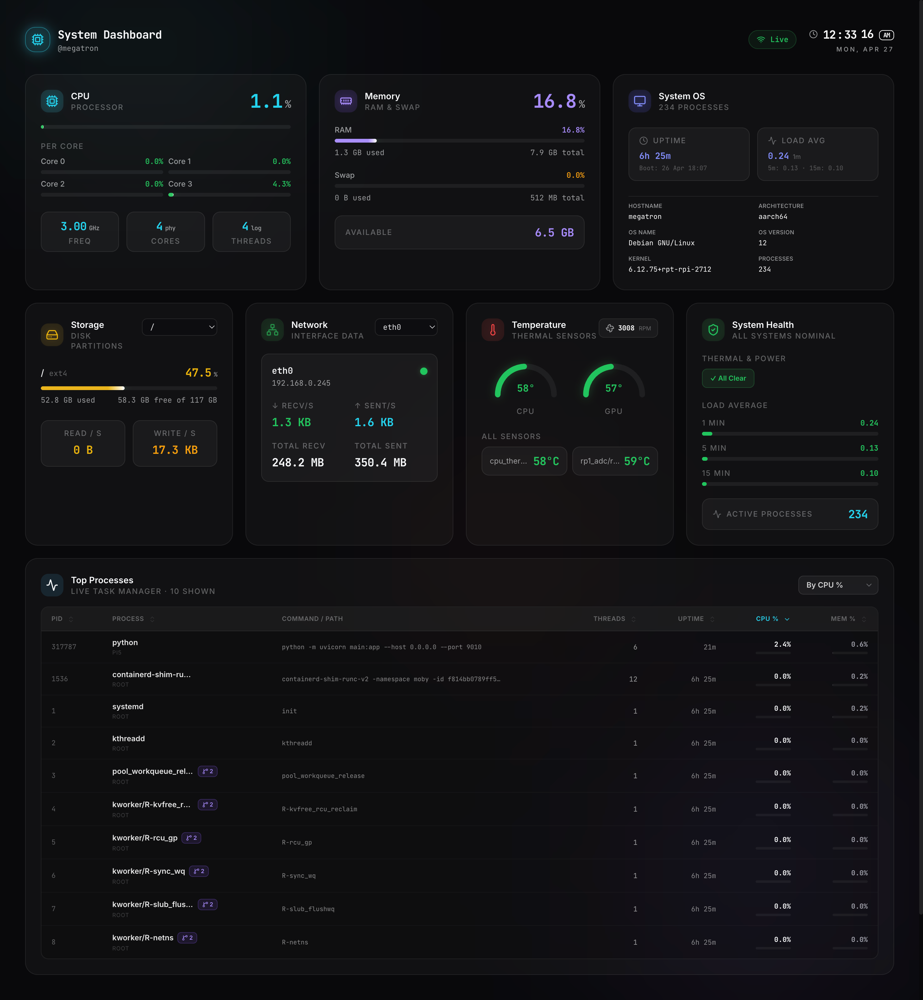

# System Dashboard

A beautiful, modern, glassmorphic system monitoring dashboard for Linux systems like Raspberry Pi 5, servers, and desktops.



**Stack:** React 19 + TypeScript + Tailwind CSS 4 + Framer Motion (frontend) · FastAPI + WebSockets + psutil (backend) · Nginx (reverse proxy) · Docker (single container)

---

## ✨ Key Features

- **💎 Premium Glassmorphism UI**: High-fidelity design with real-time blur, glow effects, and a **symmetrical 12-column grid** layout.
- **🚀 Real-Time Telemetry**: Instant system updates via persistent **WebSockets**, using a background broadcast manager for zero-latency data streaming.
- **📊 Pro Task Manager**: Enhanced 7-column sortable table tracking `PID`, `PPid`, `Threads`, `Uptime`, and `Command` (with tooltips).
- **🛡️ System Health & Thermal**: Dedicated health tracking for Pi hardware flags (Under-voltage, Throttling) and **spinning PWM Fan speed** monitoring.
- **🕒 Precision Header**: State-of-the-art real-time clock with vertical rolling digits and data "heartbeat" animations.
- **📱 Responsive Symmetry**: Perfectly balanced grid that snaps from a dense desktop view to an optimized mobile layout.

---

## Quick Start (Docker — Recommended)

### 1. Create backend `.env`

```bash
cp backend/.env.example backend/.env
# Edit backend/.env and set a strong API_KEY
nano backend/.env
```

### 2. Build and run

```bash
# Build and start (API_KEY is passed as a build arg for the frontend bundle)
API_KEY=$(grep API_KEY backend/.env | cut -d= -f2) docker compose up -d --build
```

### Option B: Docker CLI (Alternative)

If you prefer using standard Docker commands:

```bash
# 1. Build
docker build --build-arg VITE_API_KEY=your-secret-key -t pi5-dashboard:latest .

# 2. Run
docker run -d \
  --name pi5-dashboard \
  --restart unless-stopped \
  -p 80:80 \
  --env-file backend/.env \
  --pid host \
  -v /proc:/proc:ro \
  -v /sys:/sys:ro \
  pi5-dashboard:latest
```

*(Note: Mapping `/dev/vchiq` is only applicable to Raspberry Pi hardware and may fail on other Linux distributions if the driver is not loaded.)*

### 3. Access

Open `http://<your-ip>` in a browser.

---

## Security

| Layer | Mechanism |
|---|---|
| **Authentication** | `X-API-Key` header (REST) or `token` query param (WebSockets) |
| **Protocol** | Bi-directional WebSockets with automatic exponential backoff reconnection |
| **Rate limiting** | Nginx: 30 req/min per IP on `/api`, limited simultaneous WS connections |
| **Security headers** | `X-Frame-Options`, `X-Content-Type-Options`, `CSP`, etc. |
| **No info leakage** | Nginx version hidden, Swagger UI disabled |
| **CORS** | Configurable via `ALLOWED_ORIGINS` env var |

> ⚠️ For public internet exposure, put this behind a reverse proxy (Cloudflare / Caddy / Nginx) with **HTTPS (TLS)**.

---

## Local Development (without Docker)

### Backend

```bash
cd backend
cp .env.example .env  # Set API_KEY
pip install -r requirements.txt
uvicorn main:app --reload --port 8000
```

### Frontend

```bash
cd frontend
# .env.local already created — edit VITE_API_KEY to match backend
npm run dev
```

Open `http://localhost:5173`. Vite proxies `/api` → `http://localhost:8000`.

---

## Option C: Hybrid (systemd Backend + Docker Frontend)

The best of both worlds: **Native Backend** for direct hardware sensor access and **Docker Frontend** for clean environment isolation.

### 1. Backend: systemd Service
Create `/etc/systemd/system/rpi-dash-backend.service`:
```ini
[Unit]
Description=Raspberry Pi Dashboard Backend
After=network.target

[Service]
User=your_user
WorkingDirectory=/path/to/rpi-dash/backend
# Listen on 0.0.0.0 so the container can reach the host
ExecStart=/path/to/rpi-dash/backend/.venv/bin/python -m uvicorn main:app --host 0.0.0.0 --port 8000
Restart=always
Environment=API_KEY=your_secret_key

[Install]
WantedBy=multi-user.target
```

```bash
sudo systemctl daemon-reload
sudo systemctl enable rpi-dash-backend
sudo systemctl start rpi-dash-backend
```

### 2. Frontend: Docker Container
Run this from the project root. The `--add-host` flag allows the container to talk to the host machine via `host.docker.internal`.

```bash
# Build
docker build -f Dockerfile.frontend \
  --build-arg VITE_API_KEY=your_secret_key \
  -t rpi-dash-frontend:latest .

# Run
docker run -d \
  --name rpi-dash-ui \
  -p 80:80 \
  --add-host=host.docker.internal:host-gateway \
  --restart unless-stopped \
  rpi-dash-frontend:latest
```

---

## Project Structure

```
system-dash/
├── frontend/                    # React 19 + Vite + Tailwind CSS 4
│   ├── src/
│   │   ├── api/socket.ts        # Custom WebSocket hook (useSystemSocket) with auto-reconnect logic
│   │   ├── components/
│   │   │   ├── ui/              # GlassCard, MetricBar, StatValue
│   │   │   ├── widgets/         # CpuCard, MemoryCard, DiskCard, TemperatureCard, NetworkCard, OsCard, TopProcessesCard, SystemHealthCard
│   │   │   ├── Header.tsx       # Dynamic clock + connectivity
│   │   │   ├── RealTimeClock.tsx # Precision animated time component
│   │   │   └── LoadingStates.tsx
│   │   ├── lib/utils.ts         # cn, formatBytes, status color helpers
│   │   ├── types/metrics.ts     # TypeScript types matching FastAPI models
│   │   ├── App.tsx              # Symmetrical 6-column grid layout
│   │   └── index.css            # Design tokens + glass utilities
│   └── .env.local               # VITE_API_KEY for local dev
├── backend/
│   ├── main.py                  # FastAPI app with psutil collectors
│   ├── requirements.txt
│   └── .env.example             # Copy to .env and set API_KEY
├── nginx/
│   └── nginx.conf               # Serves SPA + proxies /api, security headers
├── Dockerfile                   # Multi-stage: Node build → Python runtime
├── docker-compose.yml
├── entrypoint.sh                # Starts uvicorn, waits for health, then nginx
└── .dockerignore
```

---

## Monitored Metrics

| Widget | Metrics |
|---|---|
| **CPU** | Overall %, per-core %, frequency, core/thread count |
| **Memory** | RAM used/total/%, swap used/total/% |
| **Temperature** | CPU °C, GPU °C, **spinning PWM Fan RPM**, °F secondary readings |
| **Health** | Under-voltage, Throttling, Freq capping, Load Average (1m/5m/15m) |
| **Disk** | Per-partition usage %, device paths, fstype, read/write bytes/sec |
| **Network** | Per-interface recv/sent rates + session totals, IP address |
| **OS Info** | Hostname, platform, kernel, architecture, boot time, uptime |
| **Processes** | 7-column table: PID, PPID, User, CPU, Mem, Threads, Uptime, Command |
