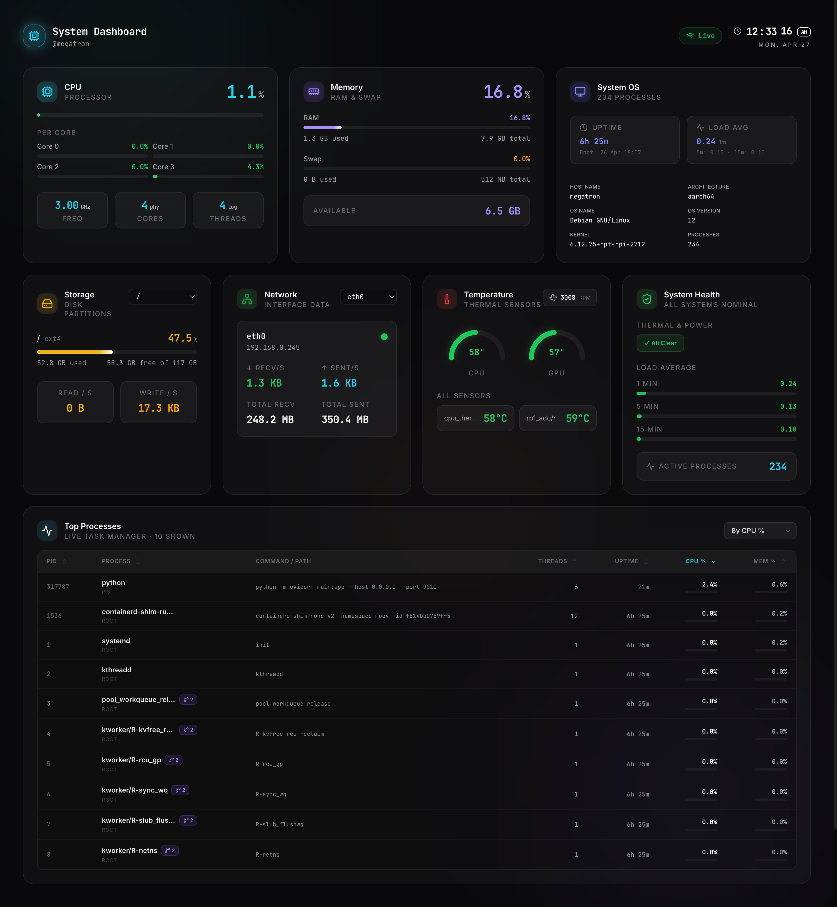

# System Dashboard

A beautiful, modern, glassmorphic system monitoring dashboard for Linux systems like Raspberry Pi 5, servers, and desktops.



**Stack:** React 19 + TypeScript + Tailwind CSS 4 + Framer Motion (frontend) · Go + chi + WebSockets + gopsutil (backend) · Nginx (reverse proxy) · Docker (single container)

---

## ✨ Features

- **💎 Glassmorphism UI** — Real-time blur, glow effects, and a symmetrical 12-column grid layout.
- **🚀 Real-Time Telemetry** — Persistent WebSocket stream with a broadcast loop; zero per-request recomputation.
- **📋 Journald Log Viewer** — Browse and filter systemd journal logs by unit, with live tail support.
- **📊 Process Manager** — Sortable 7-column table: PID, PPID, User, CPU%, Mem%, Threads, Uptime, Command.
- **🛡️ System Health** — Raspberry Pi hardware flags (under-voltage, throttling, freq-capping), PWM fan RPM.
- **🕒 Precision Clock** — Rolling-digit real-time clock with WebSocket heartbeat indicator.
- **📱 Responsive** — Dense desktop grid that snaps to an optimized mobile layout.

---

## Quick Start (Docker — Recommended)

### 1. Create `.env`

```bash
cp backend-go/.env.example backend-go/.env
# Set a strong API_KEY
nano backend-go/.env
```

`.env` format:
```
API_KEY=your-secret-key
ALLOWED_ORIGINS=*
```

### 2. Build and run

```bash
API_KEY=$(grep API_KEY backend-go/.env | cut -d= -f2) docker compose up -d --build
```

### Alternative: Docker CLI

```bash
# Build
docker build --build-arg VITE_API_KEY=your-secret-key -t sys-dash:latest .

# Run
docker run -d \
  --name sys-dash \
  --restart unless-stopped \
  -p 80:80 \
  --env-file backend-go/.env \
  --pid host \
  -v /proc:/proc:ro \
  -v /sys:/sys:ro \
  -v /run/log/journal:/run/log/journal:ro \
  -v /var/log/journal:/var/log/journal:ro \
  -v /etc/machine-id:/etc/machine-id:ro \
  sys-dash:latest
```

> The journal volume mounts are only required for the Log Viewer feature. The `/proc` and `/sys` mounts are needed for accurate sensor and metric readings.

### 3. Access

Open `http://<your-ip>` in a browser.

---

## Local Development

### Backend (Go)

```bash
cd backend-go
cp ../.env.example .env  # or create manually with API_KEY=...
go run .
# Listening on 127.0.0.1:8000
```

### Frontend (Vite + React)

```bash
cd frontend
# Create .env.local with VITE_API_KEY matching the backend
echo "VITE_API_KEY=your-secret-key" > .env.local
npm install
npm run dev
# Open http://localhost:5173 — Vite proxies /api and /ws to :8000
```

---

## Security

| Layer | Mechanism |
|---|---|
| **Authentication** | `X-API-Key` header (REST) · `?token=` query param (WebSocket) |
| **Transport** | Bi-directional WebSocket with automatic exponential backoff reconnection |
| **Rate limiting** | Nginx: 30 req/min per IP on `/api`, burst of 10 |
| **Security headers** | `X-Frame-Options`, `X-Content-Type-Options`, `CSP`, `Referrer-Policy` |
| **No info leakage** | Nginx `server_tokens off`, upstream `Server` header stripped |
| **CORS** | Configurable via `ALLOWED_ORIGINS` env var (defaults to `*`) |

> For public internet exposure, place this behind a TLS-terminating reverse proxy (Cloudflare / Caddy / Nginx).

---

## API Endpoints

| Method | Path | Auth | Description |
|---|---|---|---|
| `GET` | `/api/health` | None | Liveness check |
| `GET` | `/api/metrics` | `X-API-Key` | Latest cached metrics snapshot (JSON) |
| `GET` | `/api/logs` | `X-API-Key` | Journald log entries (`?unit=`, `?lines=`) |
| `GET` | `/api/logs/units` | `X-API-Key` | List available systemd units |
| `GET` | `/api/services` | `X-API-Key` | Running systemd services from cgroup sysfs |
| `GET` | `/ws/metrics` | `?token=` | WebSocket stream — pushes snapshot every 2 s |

---

## Monitored Metrics

| Widget | Metrics |
|---|---|
| **CPU** | Overall %, per-core %, frequency, core/thread count |
| **Memory** | RAM used/total/%, swap used/total/% |
| **Temperature** | CPU °C, GPU °C, PWM fan RPM, °F secondary readings |
| **System Health** | Under-voltage, throttling, freq-capping flags; load average 1m/5m/15m |
| **Disk** | Per-partition usage %, device paths, fstype, inode usage, read/write bytes/sec |
| **Network** | Per-interface recv/sent rates + session totals, IP address |
| **OS Info** | Hostname, platform, kernel, architecture, boot time, uptime |
| **Processes** | PID, PPID, User, CPU%, Mem%, Threads, Uptime, Command |
| **Logs** | Journald log entries filterable by systemd unit |

---

## Project Structure

```
sys-dash/
├── frontend/                    # React 19 + Vite + Tailwind CSS 4
│   └── src/
│       ├── api/socket.ts        # useSystemSocket — WebSocket hook with auto-reconnect
│       ├── components/
│       │   ├── ui/              # GlassCard, MetricBar, StatValue
│       │   ├── widgets/         # CpuCard, MemoryCard, DiskCard, TemperatureCard,
│       │   │                    # NetworkCard, OsCard, TopProcessesCard,
│       │   │                    # SystemHealthCard, LogCard
│       │   ├── Header.tsx       # Real-time clock + WebSocket heartbeat
│       │   └── LoadingStates.tsx
│       ├── lib/utils.ts         # cn, formatBytes, status colour helpers
│       ├── types/metrics.ts     # TypeScript types mirroring Go models
│       └── App.tsx              # 12-column grid layout
├── backend-go/                  # Go backend (chi router + gopsutil)
│   ├── main.go                  # Router, middleware, graceful shutdown
│   ├── metrics/                 # Collectors: cpu, memory, disk, network,
│   │   │                        # temperature, processes, osinfo, sysfs, state
│   │   └── models.go            # SystemMetrics struct
│   ├── ws/                      # WebSocket hub + broadcast loop (2 s interval)
│   ├── logs/                    # Journald log reader + unit discovery
│   ├── go.mod
│   └── go.sum
├── nginx/
│   └── nginx.conf               # Serves SPA, proxies /api + /ws, rate limits, security headers
├── backend/                     # Legacy Python backend (unused in Docker build)
│   ├── main.py
│   └── requirements.txt
├── Dockerfile                   # Multi-stage: Node → Go → debian:bookworm-slim
├── Dockerfile.frontend          # Frontend-only build (Nginx SPA)
├── docker-compose.yml
├── entrypoint.sh                # Starts Go binary, waits for health, then Nginx
└── .dockerignore
```
